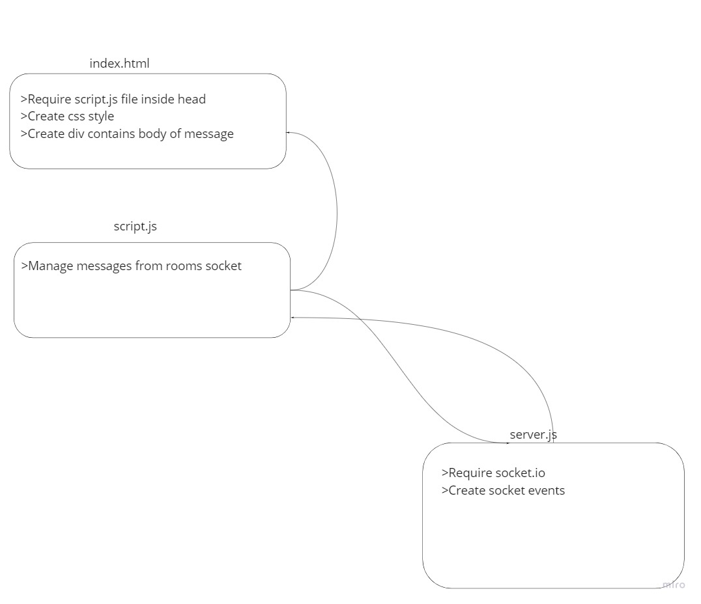

# Lab-13-Chat  

## The name of app.  
Lab-13-Chat  

## Full description about what the application does  
In this lab I created chat app using socket.io package  
and in this app I have two main section firsteval for between two clients  
or you can create room and join in it to chat with specific clients.

## Explain how you built the application and what technologies you used (also mention the libraries and tools).  
Firsteval I ceated frontend pages inside index.html  
then I created  client folder contains script.js file to manage messages  
and I created a server.js file contains  socket events.  
I used few libraries ejs  socket.io  @socket.io/admin-ui socket.io-client

##  Explain how the application work (how you can run it & use it) .
To run application , choose client folder then run it (npm start) then 
choose server folder run it (npm start) 
we need to run 2 browsers then write this link 
localhost:8080 

## Image for the UML.

